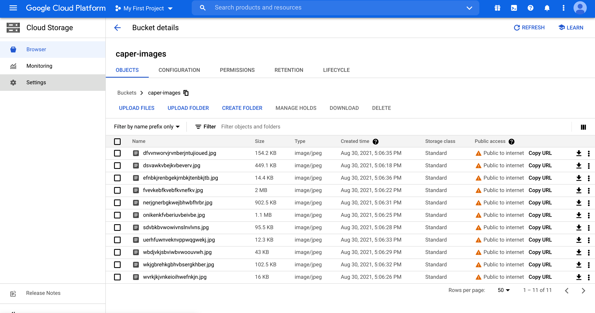
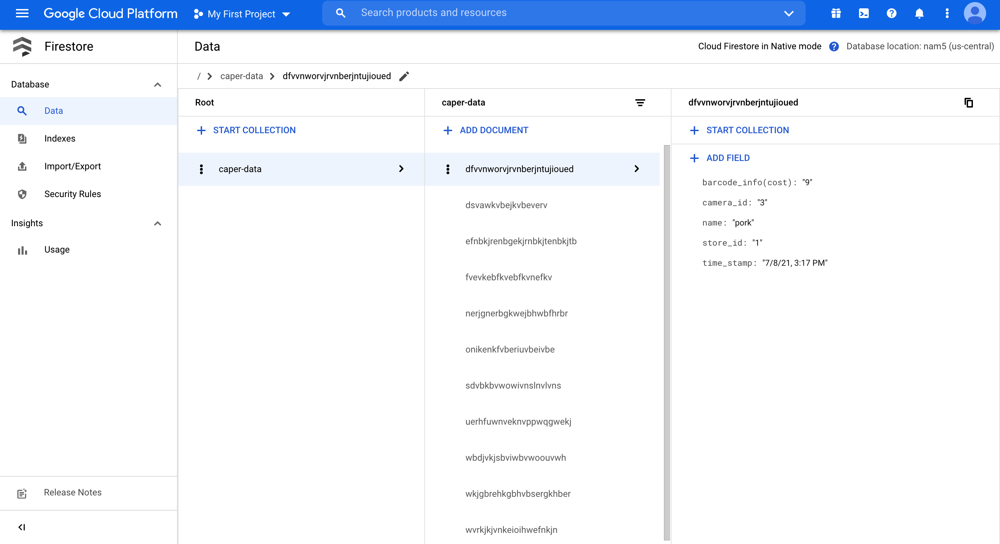

# Image Data Management

The Architecture of the data storage system is shown below.

 
----------------------------------
I am using GCP cloud storage and Firestore for saving images and respective metadata.
 
I have made a number of assumptions while building the storage system.
 
1. I am receiving the images in the data/images folder and a csv file containing metadata about the images(This part can be modified easily based on how we are receiving data).
 
2. The storage is supposed to be on cloud.(I decided to use GCP).
--------------------------------------
 
 
auth :- It contains the json file required for Authentication for connecting with the cloud (You need to genrate your own service key for running the code).
 
data:- This contains data received from frontend(images,csv).
 
downloaded_img:- The storage location where the images are being downloaded from cloud.
 
src:- This folder contains all the code.
--------------------------------------------------
demo.py:- This is the py file containing the main(). It also contains an option to choose the action.
 
ImageManager.py:- This  file manages class handling Authentication and connection with the cloud storage and firestore.
 
ImageStorageClient.py:- This file have all the task function such as upload, download and read.
 
---------------------------------------------------
 
 
## Running the code:-
 
### Steps required to run and test this code.
 
### Creating virtual env
 
conda create -n caper python=3.8
 
### Activate env
 
conda activate caper
 
### Install relevant packages
 
pip install --upgrade firebase-admin
 
pip install --upgrade google-cloud-storage
 
 
 
1 .git clone https://github.com/abhisingh977/image_data_management.git
 
2. cd image_data_management
 
3. python src/demo.py
 
4. Enter the path of folder: /././image_data_management/
 
## Options:
 
### Update storage: Press 1
          
### Read stored data: Press 2
          
### Download images: Press 3
 
 
-------------------------------------------------------
 ## Cloud storage of images. 

 ## Firestore storage of metadata. 

 -------------------------------------------------------

 Future improvements:-
 
 1. Query function :- For querying NoSql database based on feature value like Store, Camera, Product.

 2. Batch update :- Bacth update of multimedia is not available in google cloud storage as of now. 
 
 3. Data privacy :- Data is public for now for better access. Need to be private in production.

4. Key privacy:- Hide the key when in production.
 
 
 
# Feel free to ask any question or doubt.
 
