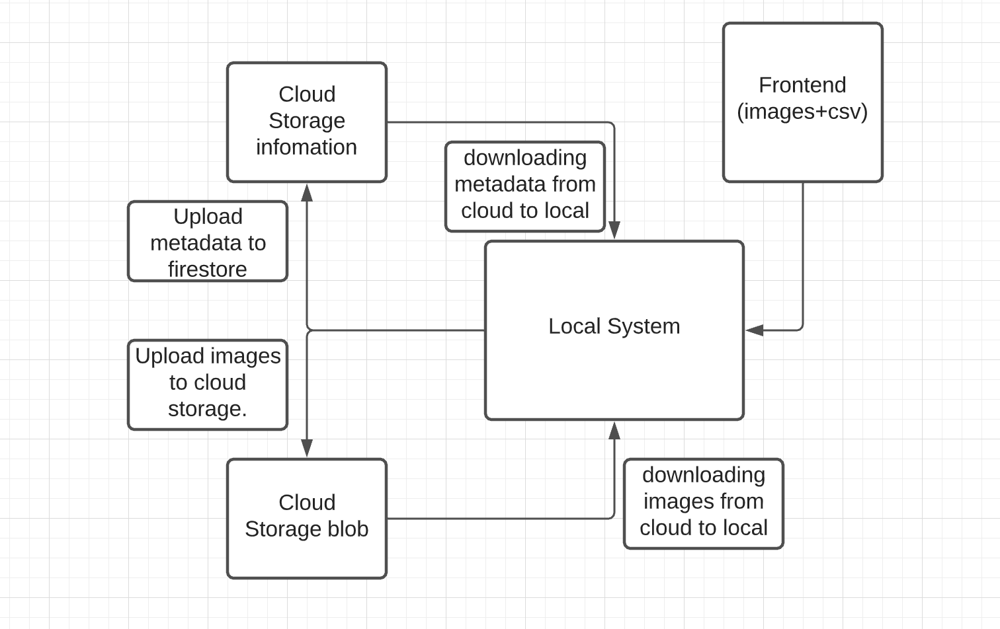

# image_data_management

The Architecture of the data storage system is show below.

----------------------------------
I am using GCP cloud storage and firestore for saving images and respective metadata.

I have made number of assumption while making building the storage system.
1. I am reciving the images in data/images folder and csv file containing metadata about the images.

2. The storage is suppose to be on cloud.(I decided to use GCP).
--------------------------------------

auth :- It contains josn file required for Authentication for connecting with cloud.
data:- This contian data recived from frontend(images,csv).
downloaded_img:- The storage location where the images are being downloaded from cloud.

src:- This folder contains all the code.
--------------------------------------------------
demo.py:- This is the py file contaning the main(). It also contain option to choose the action.

ImageManager.py:- This  file manages class handeling Authentication and connection with the cloud storage and firestore.

ImageStorageClient.py:- This file have all the task fuction such as upload, download and read.
---------------------------------------------------

Running the code:- 

Steps required to run and test this code.

Creating virtual env

conda create -n caper python=3.8

Activate env
conda activate caper

install relevant packages 

pip install --upgrade firebase-admin
pip install --upgrade google-cloud-storage

1 .git clone https://github.com/abhisingh977/image_data_management.git

2. cd image_data_management

3. python src/demo.py

"""
Enter path of folder:
"""

/././image_data_management/

"""
Update storage: Press 1 
            
Read stored data: Press 2
            
Download images: Press 3
 
"""

-------------------------------------------------------

Feel free to ask any question or doubt. 

